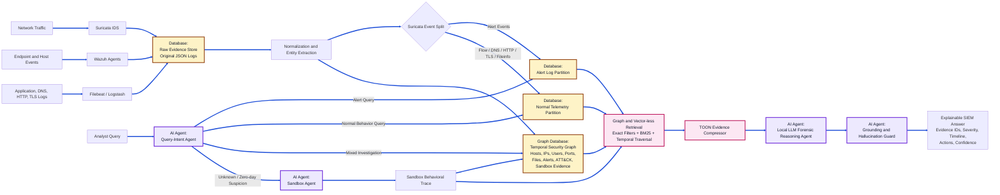

# DataLex: An Offline Agentic Graph-RAG Framework for Explainable SIEM Log Analysis and Zero-Day Threat Triage

Abu Syeed Sajid Ahmed, Arpita Paul  
Department of Computer Science and Engineering, University of Dhaka, Bangladesh  
Email: sajidahmed696@gmail.com, arpi.paul1304058@gmail.com

## Abstract

Security Information and Event Management (SIEM) systems must process large volumes of heterogeneous security telemetry while providing timely, explainable, and privacy-preserving threat analysis. However, conventional SIEM solutions rely heavily on static signatures and manually defined correlation rules, while existing Large Language Model (LLM)- and Retrieval-Augmented Generation (RAG)-based approaches remain challenged by context-window limitations, hallucination, inefficient processing of structured logs, and the detection of previously unseen attack behaviors. This paper presents DataLex, an offline agentic framework for explainable SIEM log analysis and zero-day threat triage. DataLex integrates Suricata and Wazuh telemetry with local LLM inference, graph-based and vector-less retrieval, query-intent-driven alert/normal log routing, TOON-based evidence compression, and sandbox-assisted anomaly analysis. The framework first separates Suricata alert events from normal telemetry and then performs deterministic, sparse, and temporal graph-based retrieval to construct evidence-grounded context for forensic reasoning. A grounding and hallucination guard validates generated claims against retrieved security evidence, while suspicious anomalous telemetry can be escalated to an isolated sandbox for behavioral analysis. Evaluation of the existing DataLex prototype on 500 manually labeled LLM responses achieved 92.40% accuracy, 95.12% recall, 91.12% F1-score, a 3.00% false-positive rate, and 3.20 s average response time, outperforming the reported traditional SIEM baseline. These results demonstrate the potential of offline, evidence-grounded agentic reasoning for SIEM analysis, while the proposed graph retrieval, TOON optimization, and sandbox-assisted zero-day triage components require further ablation-based validation.


**Keywords:** SIEM, Agentic AI, GraphRAG, Vector-less RAG, TOON, Suricata, Wazuh, Zero-day Detection, LLM, Cybersecurity

## 1. Introduction

Security Information and Event Management (SIEM) systems are central to modern cyber defense because they collect, normalize, correlate, and explain security events across networks, endpoints, cloud workloads, and application services. The operational demand for SIEM has increased sharply as organizations generate high-volume telemetry from intrusion detection systems, endpoint agents, authentication systems, firewalls, DNS resolvers, and web applications. This growth creates a scientific and engineering challenge: defenders must reason over large, noisy, time-dependent, and heterogeneous log streams while responding quickly enough to contain emerging attacks. The challenge is especially severe for finance, healthcare, education, military, and critical infrastructure environments where data sovereignty, low cost, explainability, and offline operation are practical deployment requirements.

However, existing intelligent SIEM approaches still leave several challenges unresolved for production-scale security operations. Traditional signature- and rule-based systems are effective for known threats but remain limited in identifying previously unseen or behaviorally novel attacks. Machine learning and deep learning approaches improve anomaly detection but often require domain-specific features, labeled datasets, continuous tuning, and provide limited evidence-grounded explanations. More recent LLM- and RAG-based approaches improve semantic reasoning and contextual analysis, yet remain vulnerable to hallucination when processing large-scale security logs and inefficient use of context windows when structured telemetry contains substantial repetitive information. Graph-based RAG further improves multi-hop reasoning over interconnected security evidence, but existing approaches generally lack an integrated mechanism for distinguishing explicit security alerts from potentially suspicious non-alert telemetry and escalating such anomalies for deeper behavioral analysis.

In this paper, we develop DataLex, an offline, explainable, agentic SIEM framework designed to address these limitations through evidence-grounded reasoning over heterogeneous security telemetry. DataLex integrates Suricata and Wazuh with local LLM inference, graph-based and vector-less retrieval, and sandbox-assisted anomaly analysis. In particular, a query-intent agent distinguishes Suricata-generated alerts from normal network and endpoint telemetry before retrieval, allowing the system to allocate context selectively and investigate suspicious non-alert behavior that may indicate previously unknown attack activity.
The main contributions of this work are as follows:

1. An offline, evidence-grounded agentic SIEM framework: We propose DataLex, an offline architecture that integrates Suricata and Wazuh telemetry with local LLM inference, security-graph reasoning, retrieval, and controlled sandbox analysis, enabling privacy-preserving and explainable security investigation without transmitting raw telemetry to external LLM services.
2. Alert-aware and behavior-aware SIEM investigation: We introduce a query-intent routing mechanism that distinguishes explicit security alerts from normal telemetry and mixed investigations before retrieval. This enables the framework to investigate both signature-detected incidents and suspicious non-alert behavior that may otherwise remain outside conventional alert-centric workflows.
3. Graph-based and vector-less evidence retrieval: We develop a graph-first retrieval strategy that combines deterministic filtering, sparse retrieval, temporal constraints, and bounded entity traversal. Unlike approaches that rely primarily on dense vector retrieval, the proposed method exploits the structured identifiers and temporal relationships inherent in security telemetry to construct evidence-grounded investigation contexts.
4. Token-efficient and traceable evidence representation: We introduce a TOON-based prompt serialization layer that reduces repetitive structural overhead when presenting large batches of security events to local LLMs while maintaining reversible mappings between compressed evidence and immutable source log records.
5. Evidence-grounded agentic reasoning with hallucination control: We introduce a forensic reasoning pipeline in which generated claims are validated against retrieved log records, graph relationships, temporal evidence, and sandbox observations. Unsupported statements are rejected or explicitly represented as hypotheses, improving the traceability of LLM-generated security explanations.
6. Sandbox-assisted triage of previously unseen behavior: We propose a controlled anomaly-analysis path that escalates suspicious non-alert telemetry and related artifacts to an isolated sandbox for behavioral inspection. Rather than directly classifying such activity as zero-day attacks, the framework combines behavioral observations with telemetry and signature evidence to support confidence-aware triage of potentially unknown threats.
7. Empirical evaluation of the prototype: We evaluate the existing DataLex prototype using 500 manually labeled LLM responses and report 92.40% accuracy, 95.12% recall, 91.12% F1-score, a 3.00% false-positive rate, and 3.20 s average response time. These results establish the performance baseline for evaluating the additional graph retrieval, TOON optimization, and sandbox-assisted components in future controlled ablation experiments.

The remainder of this paper is organized as follows. Section II reviews related works. Section III describes the system environment and assumptions. Section IV presents the methodology and proposed DataLex framework. Section V discusses the performance evaluation. Section VI concludes the paper and outlines future research directions.

## 2. Related Works

Early SIEM research from 2010 to 2015 focused on centralized log collection, rule-based correlation, signature-driven intrusion detection, and dashboard-centric analyst workflows. These approaches were practical and interpretable, but they were brittle against polymorphic malware, slow attack campaigns, and unknown behaviors that did not match predefined signatures. From 2015 to 2020, research increasingly adopted machine learning for anomaly detection, user behavior analytics, and intrusion classification. These systems improved detection coverage but often required carefully engineered features, large labeled datasets, and continuous tuning. They also produced opaque alerts, creating an explanation gap between model output and analyst action.

From 2020 onward, LLMs and RAG changed the direction of security analytics. Xu et al. systematically reviewed LLM use in cybersecurity and found applications across vulnerability detection, malware analysis, network intrusion detection, phishing detection, and proactive defense, while also identifying privacy, explainability, and dataset limitations [1]. CyberSecEval 2 and CyberSecEval 3 introduced benchmark suites for evaluating both cybersecurity capability and risk in LLMs, showing that prompt injection, unsafe helpfulness, and autonomous offensive capabilities remain unresolved concerns [2], [5]. LogLLM demonstrated that LLM-based semantic modeling can improve log anomaly detection without depending on brittle log-template parsers [6]. These studies support the use of LLMs in security operations, but they do not provide a complete offline SIEM architecture for large-scale alert and normal-log reasoning.

Recent retrieval research addresses context grounding, but not all retrieval designs are equally suited to SIEM telemetry. Edge et al. proposed GraphRAG, showing that graph-based indexing and community summaries improve global question answering over large private corpora [3]. HybridRAG combined knowledge graphs and vector retrieval, showing that graph retrieval can complement VectorRAG when domain terminology and complex structures reduce dense-retrieval reliability [4]. Tellache et al. proposed RAG-assisted autonomous incident response using CTI retrieval to enrich alerts and generate mitigation strategies [7]. In 2026, Cadet et al. presented retrieval-augmented LLMs for security incident analysis using targeted query-based filtering over multiple logs, demonstrating that RAG can recover attack infrastructure missed by LLM-only baselines [8]. Morbiato et al. proposed H-TechniqueRAG for MITRE ATT&CK annotation and reduced the candidate search space by using tactic-technique hierarchy [9]. These works show that retrieval structure matters, but they generally do not optimize for offline SIEM operation with Suricata alert/normal separation, TOON compression, and sandbox-driven zero-day triage.

Agentic and domain-specific cybersecurity systems have also advanced quickly. CyberSOCEval introduced SOC-centered LLM benchmarks for malware analysis and threat intelligence reasoning, showing that current models still leave substantial room for cyber-defense improvement [10]. CyberLLM-FINDS 2025 combined instruction tuning, RAG, and graph integration for MITRE evaluation, showing that graph context and tactic chains can improve cyber reasoning under context-window limits [11]. Kobayashi et al. demonstrated semi-autonomous penetration-testing agents that divide cyber workflows into planning, command generation, and result analysis modules [12]. Sui et al. proposed ABLE, an LLM-assisted sandbox evasion-bypass system that uses execution traces and iterative refinement to expose hidden malware behavior [13]. These works motivate agentic cyber reasoning and sandbox integration, but they do not target explainable offline SIEM triage over both alert and non-alert network telemetry.

Token efficiency is another emerging requirement for SIEM-scale LLM systems. JSON is convenient for machine-to-machine exchange, but repeated keys and nested punctuation consume valuable context-window budget when thousands of security events are injected into prompts. Recent TOON studies evaluate Token-Oriented Object Notation as a more compact structured format for LLM interaction [14], and agentic-format benchmarks report meaningful token reductions but also warn that compact formats must be validated for model-specific accuracy and parsing reliability [15]. DataLex uses TOON only inside controlled prompt envelopes and preserves original JSON logs in the evidence store, balancing token savings with forensic integrity.

Compared with the above works, DataLex is novel because it combines five design decisions in one SIEM framework: offline local inference, Suricata alert-versus-normal log routing, graph/vector-less retrieval for hallucination reduction, TOON-compressed evidence prompting, and sandbox-assisted anomaly escalation for possible zero-day behavior. Prior work solves important subproblems, but To the best of our knowledge, the reviewed works do not combine these capabilities into a single offline SIEM investigation framework. for privacy-preserving, low-cost, explainable SOC operation over large-scale logs.


## 3. System Environment and Assumptions

DataLex assumes an organization that collects network and endpoint telemetry but cannot send raw logs to external cloud LLM APIs. The environment contains Suricata for network intrusion detection, Wazuh agents for endpoint telemetry, Filebeat or Logstash for log shipping, an Elasticsearch-compatible index for raw event retention, a graph store for entity-level reasoning, and local LLM inference through an offline runtime such as Ollama. The framework can run in CPU-only mode for low-throughput environments and in GPU-accelerated mode for real-time SOC use.

The input event stream is represented as:

`E = {e_i | e_i = <t, source, event_type, entity_set, raw_payload>}`

where `t` is timestamp, `source` is the telemetry producer, `event_type` is the normalized log category, `entity_set` includes IPs, ports, hostnames, users, files, hashes, signatures, and URLs, and `raw_payload` is the immutable original record. Suricata events are partitioned into:

`E_alert = {e_i in E | source = Suricata and event_type = alert}`

`E_normal = {e_i in E | source = Suricata and event_type in {flow, dns, http, tls, fileinfo, netflow, stats}}`

This distinction is important because an analyst asking "why did Suricata raise this alert?" needs different evidence than an analyst asking "is this normal outbound DNS behavior suspicious?" DataLex therefore assumes that raw JSON logs are retained for auditability, while TOON is used only as a compact prompt representation. It also assumes that sandbox execution is isolated from production networks, has no uncontrolled internet egress, and records behavioral traces such as process trees, network connections, filesystem changes, registry changes, dropped files, and memory indicators.

The system is composed of five agents. The **Query-Intent Agent** classifies analyst intent as alert, normal telemetry, mixed investigation, or sandbox/anomaly analysis. The **Retrieval Agent** selects graph traversal, sparse search, temporal filtering, or optional vector fallback. The **Forensic Reasoning Agent** uses a local LLM to reconstruct attack narratives from retrieved evidence. The **Sandbox Agent** detonates suspicious artifacts or replays suspicious traffic in an isolated environment. The **Grounding and Hallucination Guard** verifies that each generated claim is supported by retrieved logs, graph paths, sandbox observations, or known threat-intelligence mappings.

## 4. Proposed Framework

### 4.1 Methodological Overview

DataLex follows a bottom-up methodology. First, raw telemetry is collected from network and endpoint sensors. Second, logs are normalized and separated into alert-generated Suricata events and normal telemetry. Third, a security evidence graph is built from entities and temporal relations. Fourth, analyst queries are classified by a first-level intent agent so that retrieval is performed only over the relevant evidence partition. Fifth, retrieved evidence is compressed into TOON and passed to local LLM agents for forensic reasoning. Finally, generated claims are verified against graph evidence and sandbox observations before the answer is returned.



**Fig. 1. High-level system design of DataLex**

The methodology is designed around three constraints: no raw security data leaves the organization, generated explanations must be tied to evidence IDs, and context-window usage must be minimized before LLM inference. The system therefore performs routing and retrieval before generation rather than asking the model to reason over a large undifferentiated log dump.

### 4.2 Telemetry Normalization and TOON Evidence Packaging

The first stage ingests Suricata EVE JSON, Wazuh alerts, endpoint process events, DNS logs, HTTP logs, TLS metadata, file events, and authentication records. Original logs are preserved unchanged in the raw evidence index. A normalization service extracts common fields such as timestamp, source/destination IP, source/destination port, protocol, host, user, file hash, signature ID, MITRE tactic, and severity. These fields become graph nodes and edge attributes.

Instead of injecting raw JSON directly into LLM prompts, DataLex converts selected evidence windows into TOON. For example, a Suricata alert batch can be represented as:

```toon
suricata_alerts[3]{ts,src_ip,dst_ip,dst_port,proto,sid,signature,severity}:
 2026-07-13T09:21:02Z,10.0.2.15,185.199.108.153,443,TCP,2030387,"ET MALWARE suspicious TLS beacon",2
 2026-07-13T09:21:05Z,10.0.2.15,185.199.108.153,443,TCP,2030387,"ET MALWARE suspicious TLS beacon",2
 2026-07-13T09:22:11Z,10.0.2.15,45.83.64.12,80,TCP,2018959,"ET TROJAN possible C2 checkin",1
```

The system keeps a reversible mapping from each TOON row to the original event ID. This allows the LLM to receive compact evidence while the final report cites immutable log records. TOON is not used for cryptographic evidence storage or compliance audit; it is a prompt-time optimization.

### 4.3 First-Level Alert/Normal Query Routing

The Query-Intent Agent is designed to save context-window budget before retrieval begins. It uses deterministic rules, field-aware parsing, and a lightweight local classifier to assign analyst queries to one of four routes:

1. **Alert route:** queries mentioning `signature`, `sid`, `alert`, `severity`, `category`, `blocked`, or a Suricata alert ID.
2. **Normal telemetry route:** queries about flows, DNS, HTTP, TLS, bandwidth, destination reputation, rare ports, failed connections, or behavior without an explicit alert.
3. **Mixed investigation route:** queries requiring both alert and normal context, such as lateral movement reconstruction or full attack timeline generation.
4. **Sandbox/anomaly route:** queries about suspicious files, unknown URLs, payload behavior, beaconing, encoded commands, or possible zero-day activity.

This design prevents the system from feeding thousands of irrelevant normal flow records into an alert explanation, and also prevents normal-log anomaly investigations from being biased only by signature alerts. The router outputs a TOON control object containing route, confidence, required entities, time window, and retrieval budget.

### 4.4 Graph-Based and Vector-Less Retrieval

DataLex uses a graph-first retrieval design. Nodes represent hosts, users, IP addresses, ports, domains, URLs, file hashes, processes, Suricata signatures, Wazuh rule IDs, MITRE ATT&CK techniques, sandbox behaviors, and incidents. Edges represent communication, execution, authentication, alert generation, file creation, DNS resolution, temporal proximity, and technique mapping. A query such as "explain the suspicious traffic from host 10.0.2.15 last night" triggers temporal graph traversal around the host, not a broad vector search over all logs.

The retrieval stack has three layers:

1. **Deterministic filters:** exact matching on IPs, hostnames, users, hashes, signature IDs, event types, and time windows.
2. **Sparse/vector-less retrieval:** BM25-style search over normalized fields, rule names, signatures, command lines, HTTP user agents, DNS names, and sandbox text observations.
3. **Graph traversal:** bounded multi-hop traversal over entity relationships, including attack-stage paths and MITRE tactic-technique chains.

Dense vector retrieval remains optional for unstructured analyst notes or long CTI documents, but it is not the default mechanism for raw logs. This is important because security logs are rich in exact identifiers, temporal relations, and structured fields that can be lost or blurred in embedding space. The graph also supports hallucination control: every generated claim must map to a retrieved node, edge, temporal pattern, or sandbox observation.

### 4.5 Agentic Forensic Reasoning and Hallucination Guard

After retrieval, the Forensic Reasoning Agent receives a compact TOON evidence bundle and a task-specific instruction. It generates an incident explanation, severity assessment, likely attack stage, affected assets, supporting evidence, and recommended response actions. The Grounding and Hallucination Guard then checks each factual claim against evidence IDs. Unsupported claims are removed or rewritten as hypotheses.

For example, the model may say that a host contacted a possible command-and-control endpoint only if the retrieved evidence includes a flow, DNS, HTTP, TLS, or alert record supporting that statement. If the graph contains only weak evidence, the response must explicitly mark the conclusion as low confidence. This separates evidence-backed explanation from speculative reasoning and directly addresses hallucination risk in large-log analysis.

### 4.6 Sandbox-Assisted Zero-Day and Unknown-Anomaly Handling

Known attacks are often visible through Suricata alerts, Wazuh rules, or threat-intelligence indicators. Zero-day and unknown attacks may appear only as abnormal normal logs: rare destinations, unusual protocol use, repeated low-volume beaconing, anomalous TLS fingerprints, suspicious file downloads, encoded PowerShell, or process/network combinations not seen before. DataLex therefore introduces a behind-the-scene Sandbox Agent.

When the normal telemetry route finds a high anomaly score but no matching signature, the Sandbox Agent can isolate and inspect related artifacts. It may detonate downloaded files, replay suspicious PCAP slices, inspect URLs in a controlled browser, or run command-line artifacts in a disposable virtual machine. The sandbox returns structured behavior such as created processes, persistence attempts, registry edits, file writes, network callbacks, DNS queries, anti-analysis checks, and dropped payload hashes. These observations become graph nodes and can trigger a revised incident explanation even when no prior Suricata signature exists.

The sandbox layer does not automatically declare a zero-day attack. Instead, it produces behavior-backed evidence and confidence scores. A finding is marked as possible zero-day only when anomalous normal logs, sandbox behavior, and absence of known signatures jointly support that conclusion.

### 4.7 Offline Privacy-Preserving Deployment

All components execute within the organizational perimeter. Raw logs, TOON prompt bundles, graph indexes, sandbox artifacts, and model outputs remain local. This design supports air-gapped or restricted-network environments and avoids exposing sensitive telemetry to external LLM providers. The framework is compatible with open-source models such as Llama-family models and DeepSeek-Qwen-style models, allowing organizations to choose model size and quantization according to hardware limits.

## V. PERFORMANCE EVALUATION

### A. Evaluation Objectives

The performance evaluation of DataLex is designed to assess its effectiveness as an offline, evidence-grounded intelligence layer for SIEM investigation. The evaluation does not position DataLex as a replacement for mature enterprise SIEM platforms; instead, it focuses on the ability of the proposed architecture to support semantic security investigation over heterogeneous telemetry.

The evaluation has three objectives. First, the reported DataLex prototype results are positioned against relevant LLM-, RAG-, and graph-based cybersecurity studies. Because existing studies use different datasets, tasks, models, and evaluation protocols, their numerical results are presented as literature context rather than as directly comparable benchmarks. Second, the architectural capabilities of DataLex are compared with closely related LLM-based security-analysis approaches to identify the capabilities addressed by the proposed framework. Third, the contributions of DataLex's retrieval, query-routing, token-efficient representation, grounding, and sandbox-assisted mechanisms are discussed in terms of the evaluation requirements needed to validate them experimentally.

### B. Dataset and Prototype Evaluation

The existing DataLex prototype was evaluated using Suricata and Wazuh security telemetry collected from controlled attack simulations. The evaluation consisted of 500 LLM-generated responses that were manually labeled by two cybersecurity practitioners. The responses were assessed for attack-identification correctness, consistency with the available security evidence, and validity of the recommended actions, with disagreements resolved through consensus.

The prototype achieved **92.40% accuracy, 87.44% precision, 95.12% recall, 91.12% F1-score, and a 3.00% false-positive rate**, with an average response time of **3.20 s**. These results provide an initial empirical reference for DataLex's LLM-assisted security investigation capability.

However, these measurements represent the existing prototype and should not be interpreted as an independent validation of every component introduced in the revised architecture. In particular, the graph-based retrieval, query-intent routing, TOON-based evidence representation, and sandbox-assisted anomaly-analysis components require dedicated controlled experiments to quantify their individual contributions.

### C. Comparison With Existing LLM- and RAG-Based Security Research

Recent research has demonstrated the application of LLMs, RAG, graph-based reasoning, and LLM-based log analysis to cybersecurity tasks. These studies provide important benchmarks for individual aspects of intelligent security analysis, but their evaluation settings differ from the DataLex prototype.

For example, LogLLM focuses on log anomaly detection, while RAG-based security-incident analysis evaluates retrieval-assisted investigation of malware and multi-stage attacks. GraphRAG and hierarchical RAG approaches investigate structured retrieval and reasoning over large corpora or threat-intelligence information rather than the heterogeneous Suricata and Wazuh telemetry considered by DataLex.

Consequently, numerical results from these studies should not be interpreted as direct performance comparisons with DataLex. They are included to establish the research context and identify the capabilities that have already been demonstrated in related work.

**TABLE I
REPORTED RESULTS FROM RELATED LLM/RAG-BASED SECURITY STUDIES**

| Work                | Primary Task                              | Reported Result                                                                                                        | Directly Comparable to DataLex |
| ------------------- | ----------------------------------------- | ---------------------------------------------------------------------------------------------------------------------- | ------------------------------ |
| LogLLM [6]          | Log anomaly detection                     | F1-score reported across multiple log datasets                                                                         | No                             |
| Cadet et al. [8]    | RAG-based security-incident analysis      | Up to 100% recall in evaluated malware scenarios; 100% precision and 82% recall for evaluated AD attack-step detection | Partially                      |
| H-TechniqueRAG [9]  | Threat-intelligence technique analysis    | 3.8% F1 improvement; 77.5% candidate-space reduction; 62.4% latency reduction                                          | No                             |
| CyberLLM-FINDS [11] | LLM/RAG/graph-based CTI and TTP reasoning | Improved TTP coverage reported                                                                                         | No                             |
| DataLex             | SIEM investigation                        | 92.40% accuracy; 95.12% recall; 91.12% F1-score                                                                        | —                              |

**Note:** The reported values originate from different datasets, tasks, models, and evaluation protocols and therefore must not be interpreted as a direct ranking of the systems. The DataLex values correspond to the existing 500-response prototype evaluation.

Among the reviewed studies, the RAG-based security-incident analysis by Cadet et al. [8] is particularly relevant to DataLex because it demonstrates the value of targeted retrieval for multi-source security-log investigation. Their results indicate that retrieval can recover attack infrastructure that may be missed by LLM-only analysis. DataLex builds on this general evidence-grounding principle while extending the investigation workflow with query-intent routing, graph-based and vector-less retrieval, token-efficient evidence representation, explicit grounding validation, and sandbox-assisted anomaly analysis.

### D. Capability-Level Comparison

Because most related studies do not evaluate the complete set of capabilities targeted by DataLex, a capability-level comparison is more appropriate than assigning unsupported numerical values to competing systems.

**TABLE II
CAPABILITY COMPARISON OF RELATED LLM-BASED SECURITY SYSTEMS**

| Capability                                    | LogLLM [6] | RAG Security Analysis [8] | CyberLLM-FINDS [11] | DataLex |
| --------------------------------------------- | ---------- | ------------------------- | ------------------- | ------- |
| LLM-based security analysis                   | ✓          | ✓                         | ✓                   | ✓       |
| Security-log analysis                         | ✓          | ✓                         | NR                  | ✓       |
| Retrieval-augmented reasoning                 | —          | ✓                         | ✓                   | ✓       |
| Graph-based reasoning                         | —          | —                         | ✓                   | ✓       |
| Temporal security relationships               | NR         | Partial                   | Partial             | ✓       |
| Alert/normal telemetry routing                | NR         | NR                        | NR                  | ✓       |
| Token-efficient structured-log representation | NR         | NR                        | NR                  | ✓       |
| Evidence-grounded reasoning                   | Partial    | ✓                         | ✓                   | ✓       |
| Explicit hallucination validation             | NR         | NR                        | NR                  | ✓       |
| Offline local inference                       | NR         | NR                        | Partial             | ✓       |
| Sandbox-assisted anomaly analysis             | —          | NR                        | NR                  | ✓       |

Here, **NR** denotes that the capability was not reported or independently evaluated in the cited work. It does not imply that the corresponding system is incapable of supporting the capability. A dash indicates that the capability is outside the primary scope of the cited system.

The comparison shows that existing research has addressed several individual aspects of intelligent security analysis, including log anomaly detection, retrieval-assisted incident investigation, graph-based threat-intelligence reasoning, and LLM-based cybersecurity analysis. DataLex focuses on integrating these capabilities into a single offline SIEM investigation workflow while introducing explicit alert/normal telemetry routing, token-efficient structured-log representation, hallucination validation, and sandbox-assisted anomaly triage.

### E. Retrieval and Query-Intent Evaluation

DataLex uses query-intent routing to distinguish between alert-oriented investigation, normal telemetry analysis, mixed investigation, and anomaly-oriented investigation before constructing the retrieval context. This design is intended to prevent irrelevant telemetry from consuming the LLM context window and to enable investigation of suspicious behavior that does not necessarily generate an explicit security alert.

The retrieval layer combines deterministic filtering, sparse retrieval, temporal constraints, and bounded graph traversal to construct evidence for downstream reasoning. The evaluation of this component should therefore consider retrieval precision, relevant-evidence recall, retrieval latency, input-token consumption, and final answer accuracy.

A controlled ablation should compare the complete retrieval pipeline with configurations that remove query-intent routing or graph-based retrieval. Such an experiment would determine whether the proposed mechanisms provide measurable improvements rather than assuming that architectural complexity directly translates into better performance.

### F. Token-Efficient Evidence Representation

DataLex uses TOON as a prompt-time representation while retaining the original structured security events as the authoritative evidence source. This design aims to reduce repetitive structural overhead when large numbers of security events are passed to the LLM.

The appropriate evaluation should compare equivalent evidence windows represented using conventional JSON and TOON using input-token count, response latency, evidence retention, answer accuracy, and grounded-claim ratio.

Token reduction alone is not considered sufficient evidence of improvement. A representation is useful only if it reduces context consumption while preserving the information required for accurate security reasoning. This consideration is particularly important because prior research on token-optimized structured representations has identified potential trade-offs between token efficiency and model accuracy.

### G. Evidence Grounding and Hallucination Control

DataLex incorporates a Grounding and Hallucination Guard that validates generated security claims against retrieved evidence before producing the final investigation response.

The effectiveness of this mechanism should be evaluated using both answerable and evidence-insufficient investigation questions. A generated claim is considered grounded when it can be traced to an available security event, graph relationship, temporal observation, threat-intelligence record, or sandbox observation. Claims that cannot be supported by the available evidence are classified as unsupported rather than being treated as correct based solely on the plausibility of the generated explanation.

Appropriate metrics include grounded-claim ratio, unsupported-claim ratio, factual answer accuracy, and correct-abstention rate. This evaluation directly measures whether DataLex can constrain LLM-generated security explanations to the available evidence.

### H. Sandbox-Assisted Anomaly Analysis

The sandbox pathway is intended for suspicious activity that does not necessarily correspond to an existing Suricata signature or Wazuh rule. Such activity may include unusual destinations, periodic communication patterns, anomalous protocol behavior, suspicious artifacts, or unusual process/network relationships.

The sandbox should be treated as an additional evidence-generation mechanism rather than an automatic zero-day classifier. Suspicious telemetry can be escalated to an isolated environment, where behavioral observations such as process creation, network connections, filesystem changes, and other observable activity can be incorporated into the investigation context.

The appropriate evaluation should measure anomaly-escalation precision, false-escalation rate, behavioral confirmation rate, and final analyst decision accuracy. Because the current prototype does not provide a dedicated quantitative zero-day evaluation, the sandbox-assisted zero-day pathway should be considered a proposed extension requiring future controlled experiments rather than an already validated detection capability.

### I. Hardware and Inference Performance

The existing prototype was evaluated under CPU-only and GPU-accelerated configurations. The reported inference times were **24.54 s** for CPU-only execution, **2.45 s** on an RTX 3090, **0.98 s** on an A100, and **0.61 s** on an H100. The corresponding reported throughputs were **2.45, 12.25, 24.50, and 36.75 queries/min**, respectively.

These measurements demonstrate the feasibility of local inference under different computational configurations. CPU-only execution provides a lower-throughput option for offline forensic workloads, whereas GPU acceleration substantially reduces inference latency and supports more interactive investigation.

Hardware performance is reported separately from architectural performance because inference time depends on factors including model size, quantization, context length, batching, and hardware configuration. The reported measurements therefore characterize the deployment feasibility of DataLex rather than establish a universal hardware-performance ranking.

### J. Evaluation Summary

The evaluation distinguishes between experimentally established prototype results and architectural capabilities that require further controlled validation. The existing DataLex prototype demonstrates promising performance on the evaluated security-response dataset, achieving 92.40% accuracy, 95.12% recall, 91.12% F1-score, a 3.00% false-positive rate, and 3.20 s average response time across 500 manually labeled responses.

The literature comparison further indicates that LLMs, retrieval, graph-based reasoning, and log anomaly analysis have already been investigated independently or in partial combinations for cybersecurity applications. Therefore, the primary research question addressed by DataLex is not whether LLMs or RAG can be applied to security analysis, but whether their integration with query-intent routing, security-graph retrieval, token-efficient evidence representation, explicit grounding validation, and sandbox-assisted anomaly triage can provide a more effective and explainable SIEM investigation workflow.

The existing results establish a baseline for the DataLex prototype, while dedicated ablation and controlled comparative experiments remain necessary to quantify the individual contribution of the proposed architectural components.

## 6. Conclusion

This paper presented DataLex, an offline, evidence-grounded agentic framework for SIEM investigation. The prototype evaluated on 500 manually labeled responses achieved 92.40% accuracy, 95.12% recall, 91.12% F1-score, a 3.00% false-positive rate, and 3.20 s average response time. These results validate the feasibility of local LLM reasoning for security-event interpretation when constrained by retrieved evidence.

The framework introduces alert/normal telemetry routing, graph-based and vector-less retrieval, TOON-compressed evidence prompting, an explicit grounding and hallucination guard, and sandbox-assisted anomaly analysis. These components address context-window inefficiency and hallucination in LLM-based SIEM investigation. Dedicated ablation experiments remain necessary to quantify the individual contributions of the proposed mechanisms.

Future work will explore parametric and non-parametric reinforcement learning approaches for adaptive, evidence-aware decision-making in dynamic SOC environments.

## References

[1] H. Xu, S. Wang, N. Li, K. Wang, Y. Zhao, K. Chen, T. Yu, Y. Liu, and H. Wang, "Large Language Models for Cyber Security: A Systematic Literature Review," arXiv:2405.04760, 2024. https://arxiv.org/abs/2405.04760

[2] M. Bhatt et al., "CyberSecEval 2: A Wide-Ranging Cybersecurity Evaluation Suite for Large Language Models," arXiv:2404.13161, 2024. https://arxiv.org/abs/2404.13161

[3] D. Edge et al., "From Local to Global: A Graph RAG Approach to Query-Focused Summarization," arXiv:2404.16130, 2024. https://arxiv.org/abs/2404.16130

[4] B. Sarmah, B. Hall, R. Rao, S. Patel, S. Pasquali, and D. Mehta, "HybridRAG: Integrating Knowledge Graphs and Vector Retrieval Augmented Generation for Efficient Information Extraction," arXiv:2408.04948, 2024. https://arxiv.org/abs/2408.04948

[5] S. Wan et al., "CYBERSECEVAL 3: Advancing the Evaluation of Cybersecurity Risks and Capabilities in Large Language Models," arXiv:2408.01605, 2024. https://arxiv.org/abs/2408.01605

[6] W. Guan, J. Cao, S. Qian, J. Gao, and C. Ouyang, "LogLLM: Log-based Anomaly Detection Using Large Language Models," arXiv:2411.08561, 2024. https://arxiv.org/abs/2411.08561

[7] A. Tellache, A. A. Korba, A. Mokhtari, H. Moldovan, and Y. Ghamri-Doudane, "Advancing Autonomous Incident Response: Leveraging LLMs and Cyber Threat Intelligence," arXiv:2508.10677, 2025. https://arxiv.org/abs/2508.10677

[8] X. Cadet, A. V. Singh, H. Mamania, E. Koh, A. Fitts, D. Van Bruggen, S. Boboila, P. Chin, and A. Oprea, "Retrieval-Augmented LLMs for Security Incident Analysis," arXiv:2603.18196, 2026. https://arxiv.org/abs/2603.18196

[9] F. Morbiato, M. Keller, P. Nair, and L. Romano, "Hierarchical Retrieval Augmented Generation for Adversarial Technique Annotation in Cyber Threat Intelligence Text," arXiv:2604.14166, 2026. https://arxiv.org/abs/2604.14166

[10] L. Deason et al., "CyberSOCEval: Benchmarking LLMs Capabilities for Malware Analysis and Threat Intelligence Reasoning," arXiv:2509.20166, 2025. https://arxiv.org/abs/2509.20166

[11] V. Iyer, L. Bobadilla, and S. S. Iyengar, "CyberLLM-FINDS 2025: Instruction-Tuned Fine-tuning of Domain-Specific LLMs with Retrieval-Augmented Generation and Graph Integration for MITRE Evaluation," arXiv:2601.06779, 2026. https://arxiv.org/abs/2601.06779

[12] M. Kobayashi, M. Fuchi, A. Zanashir, T. Yoneda, and T. Takagi, "Construction and Evaluation of LLM-based agents for Semi-Autonomous penetration testing," arXiv:2502.15506, 2025. https://arxiv.org/abs/2502.15506

[13] Z. Sui, L. Noureddine, M. E. Khatun, S. Bello, J. Woodring, and A. Ali-Gombe, "A Large Language Model Approach to Generating Bypass Rules for Malware Evasion in Analysis Sandbox," arXiv:2605.21821, 2026. https://arxiv.org/abs/2605.21821

[14] I. Matveev, "Token-Oriented Object Notation vs JSON: A Benchmark of Plain and Constrained Decoding Generation," arXiv:2603.03306, 2026. https://arxiv.org/abs/2603.03306

[15] L. Kutschka and B. Geiger, "Notation Matters: A Benchmark Study of Token-Optimized Formats in Agentic AI Systems," arXiv:2605.29676, 2026. https://arxiv.org/abs/2605.29676
