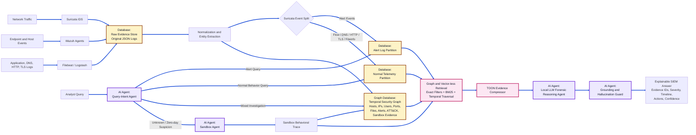

# DataLex: An Offline Agentic Graph-RAG Framework for Explainable SIEM Log Analysis and Zero-Day Threat Triage

Abu Syeed Sajid Ahmed, Arpita Paul  
Department of Computer Science and Engineering, University of Dhaka, Bangladesh  
Email: sajidahmed696@gmail.com, arpi.paul1304058@gmail.com

## Abstract

1. Modern security operations centers must investigate high-volume heterogeneous logs, but conventional SIEM pipelines still depend heavily on static signatures, manually written correlation rules, and cloud-assisted analytics that are difficult to use in privacy-sensitive environments.
2. Existing LLM- and RAG-assisted security systems improve cyber reasoning, but most do not jointly solve offline deployment, hallucination control over large-scale logs, token-efficient log prompting, alert-versus-normal log routing, and zero-day anomaly triage.
3. This paper proposes DataLex, an offline agentic SIEM intelligence framework that combines Suricata, Wazuh, local LLM inference, graph-based and vector-less retrieval, TOON-compressed evidence packaging, and sandbox-assisted anomaly analysis.
4. The framework introduces a first-level query-intent agent that separates Suricata alert-generated logs from normal telemetry before retrieval, enabling the system to reduce context-window waste and route analyst queries to the most relevant evidence graph.
5. DataLex further adds hallucination-aware graph validation, local multi-agent forensic reasoning, and behind-the-scene sandbox execution for suspicious normal logs that may represent unknown or zero-day attack behavior.
6. Evaluation of the existing DataLex prototype over 500 labeled LLM responses shows 92.40% accuracy, 95.12% recall, a 3.00% false-positive rate, and 3.20 s average response time, while the revised architecture defines additional ablations for graph retrieval, TOON compression, and sandbox-driven anomaly discovery.

**Keywords:** SIEM, Agentic AI, GraphRAG, Vector-less RAG, TOON, Suricata, Wazuh, Zero-day Detection, LLM, Cybersecurity

## 1. Introduction

Security Information and Event Management (SIEM) systems are central to modern cyber defense because they collect, normalize, correlate, and explain security events across networks, endpoints, cloud workloads, and application services. The operational demand for SIEM has increased sharply as organizations generate high-volume telemetry from intrusion detection systems, endpoint agents, authentication systems, firewalls, DNS resolvers, and web applications. This growth creates a scientific and engineering challenge: defenders must reason over large, noisy, time-dependent, and heterogeneous log streams while responding quickly enough to contain emerging attacks. The challenge is especially severe for finance, healthcare, education, military, and critical infrastructure environments where data sovereignty, low cost, explainability, and offline operation are practical deployment requirements.

Traditional SIEM deployments address this problem through signatures, correlation rules, dashboards, and analyst-written searches. Machine learning and deep learning methods later improved anomaly detection, but many systems still struggle with semantic interpretation, alert fatigue, adversarial drift, and poor explanation quality. Recent LLM-based cybersecurity studies show that language models can support vulnerability analysis, malware reasoning, log interpretation, and incident response [1], [2]. RAG-based methods improve grounding by retrieving relevant context before generation, and graph-based RAG improves multi-hop reasoning over large corpora [3], [4]. However, these works generally leave three gaps unresolved for production SIEM use: hallucination control when logs are too large for the context window, token-efficient representation of structured security logs, and efficient separation of Suricata alert events from normal but potentially suspicious telemetry.

In this paper, we develop **DataLex**, an offline, explainable, agentic SIEM framework for privacy-preserving cyber intelligence. The framework replaces a conventional vector-only RAG pipeline with a hybrid graph-based and vector-less retrieval design. It indexes alert entities, normal network flows, hosts, users, ports, signatures, MITRE ATT&CK techniques, and sandbox observations as a temporal security graph, while also using deterministic filters and sparse retrieval over indexed logs. The model routes analyst questions through a first-level query-intent agent that decides whether the query concerns Suricata alerts, normal logs, mixed evidence, or sandbox/anomaly investigation. The main contributions are:

1. An offline agentic SIEM architecture integrating Suricata, Wazuh, Elasticsearch-compatible indexing, local LLMs, graph retrieval, and sandbox-assisted malware/anomaly analysis.
2. A Suricata-aware query router that separates alert-generated EVE records from normal telemetry before retrieval, reducing irrelevant context and improving token use.
3. A graph-based and vector-less RAG pipeline that emphasizes entity traversal, temporal windows, MITRE ATT&CK mappings, sparse keyword retrieval, and structured evidence validation instead of relying only on dense embeddings.
4. A TOON-based log serialization layer that replaces JSON inside LLM prompts to reduce repeated key overhead in large log batches.
5. A sandbox-backed zero-day triage path that escalates anomalous normal logs, suspicious files, URLs, command lines, or packet captures for controlled execution and behavioral feature extraction.
6. An empirical baseline from the existing DataLex prototype demonstrating improved accuracy, recall, false-positive reduction, and response time compared with a traditional SIEM baseline.

The remainder of this paper is organized as follows. Section II reviews related works. Section III describes the system environment and assumptions. Section IV presents the methodology and proposed DataLex framework. Section V discusses the performance evaluation. Section VI concludes the paper and outlines future research directions.

## 2. Related Works

Early SIEM research from 2010 to 2015 focused on centralized log collection, rule-based correlation, signature-driven intrusion detection, and dashboard-centric analyst workflows. These approaches were practical and interpretable, but they were brittle against polymorphic malware, slow attack campaigns, and unknown behaviors that did not match predefined signatures. From 2015 to 2020, research increasingly adopted machine learning for anomaly detection, user behavior analytics, and intrusion classification. These systems improved detection coverage but often required carefully engineered features, large labeled datasets, and continuous tuning. They also produced opaque alerts, creating an explanation gap between model output and analyst action.

From 2020 onward, LLMs and RAG changed the direction of security analytics. Xu et al. systematically reviewed LLM use in cybersecurity and found applications across vulnerability detection, malware analysis, network intrusion detection, phishing detection, and proactive defense, while also identifying privacy, explainability, and dataset limitations [1]. CyberSecEval 2 and CyberSecEval 3 introduced benchmark suites for evaluating both cybersecurity capability and risk in LLMs, showing that prompt injection, unsafe helpfulness, and autonomous offensive capabilities remain unresolved concerns [2], [5]. LogLLM demonstrated that LLM-based semantic modeling can improve log anomaly detection without depending on brittle log-template parsers [6]. These studies support the use of LLMs in security operations, but they do not provide a complete offline SIEM architecture for large-scale alert and normal-log reasoning.

Recent retrieval research addresses context grounding, but not all retrieval designs are equally suited to SIEM telemetry. Edge et al. proposed GraphRAG, showing that graph-based indexing and community summaries improve global question answering over large private corpora [3]. HybridRAG combined knowledge graphs and vector retrieval, showing that graph retrieval can complement VectorRAG when domain terminology and complex structures reduce dense-retrieval reliability [4]. Tellache et al. proposed RAG-assisted autonomous incident response using CTI retrieval to enrich alerts and generate mitigation strategies [7]. In 2026, Cadet et al. presented retrieval-augmented LLMs for security incident analysis using targeted query-based filtering over multiple logs, demonstrating that RAG can recover attack infrastructure missed by LLM-only baselines [8]. Morbiato et al. proposed H-TechniqueRAG for MITRE ATT&CK annotation and reduced the candidate search space by using tactic-technique hierarchy [9]. These works show that retrieval structure matters, but they generally do not optimize for offline SIEM operation with Suricata alert/normal separation, TOON compression, and sandbox-driven zero-day triage.

Agentic and domain-specific cybersecurity systems have also advanced quickly. CyberSOCEval introduced SOC-centered LLM benchmarks for malware analysis and threat intelligence reasoning, showing that current models still leave substantial room for cyber-defense improvement [10]. CyberLLM-FINDS 2025 combined instruction tuning, RAG, and graph integration for MITRE evaluation, showing that graph context and tactic chains can improve cyber reasoning under context-window limits [11]. Kobayashi et al. demonstrated semi-autonomous penetration-testing agents that divide cyber workflows into planning, command generation, and result analysis modules [12]. Sui et al. proposed ABLE, an LLM-assisted sandbox evasion-bypass system that uses execution traces and iterative refinement to expose hidden malware behavior [13]. These works motivate agentic cyber reasoning and sandbox integration, but they do not target explainable offline SIEM triage over both alert and non-alert network telemetry.

Token efficiency is another emerging requirement for SIEM-scale LLM systems. JSON is convenient for machine-to-machine exchange, but repeated keys and nested punctuation consume valuable context-window budget when thousands of security events are injected into prompts. Recent TOON studies evaluate Token-Oriented Object Notation as a more compact structured format for LLM interaction [14], and agentic-format benchmarks report meaningful token reductions but also warn that compact formats must be validated for model-specific accuracy and parsing reliability [15]. DataLex uses TOON only inside controlled prompt envelopes and preserves original JSON logs in the evidence store, balancing token savings with forensic integrity.

Compared with the above works, DataLex is novel because it combines five design decisions in one SIEM framework: offline local inference, Suricata alert-versus-normal log routing, graph/vector-less retrieval for hallucination reduction, TOON-compressed evidence prompting, and sandbox-assisted anomaly escalation for possible zero-day behavior. Prior work solves important subproblems, but none provides this complete architecture for privacy-preserving, low-cost, explainable SOC operation over large-scale logs.

### 2.1 Summary of 2024-2026 Closely Related Papers

| Ref. | Year | Key contribution | Remaining gap addressed by DataLex |
|---|---:|---|---|
| [1] | 2024 | Surveyed 127 LLM4Security papers and mapped tasks such as vulnerability, malware, intrusion, and phishing analysis. | Survey-level work; no deployable offline SIEM pipeline. |
| [2], [5] | 2024 | Benchmarked LLM cybersecurity risks and capabilities, including prompt injection and autonomous offensive behavior. | Evaluation focus; no SIEM retrieval or log-token optimization. |
| [3] | 2024 | Introduced GraphRAG for global questions over private corpora. | General corpus QA; not Suricata/Wazuh/SOC specific. |
| [4] | 2024 | Combined graph and vector retrieval to improve domain QA. | Not designed for real-time security telemetry or alert routing. |
| [6] | 2024 | Used LLM semantic representations for log anomaly detection. | Focused on anomaly classification, not explainable SIEM investigation. |
| [7] | 2025 | Used RAG and CTI to automate incident response. | Relies on CTI retrieval, not offline SIEM graph reasoning over raw logs. |
| [10] | 2025 | Introduced SOC-centered LLM benchmarks for malware and threat intelligence reasoning. | Benchmark suite; no deployment architecture. |
| [12] | 2025 | Built semi-autonomous cyber agents for penetration-testing workflows. | Offensive workflow automation, not defensive SIEM triage. |
| [13] | 2026 | Used LLMs and sandbox traces to expose hidden malware behavior. | Malware-sandbox specific; not integrated with SIEM log routing. |
| [8] | 2026 | Used targeted query filtering and RAG for incident analysis across multiple logs. | RAG-centered; does not add TOON, alert/normal separation, or sandbox anomaly handling. |
| [9] | 2026 | Used ATT&CK hierarchy to reduce retrieval scope and latency. | CTI annotation focus; not full SIEM telemetry. |
| [11] | 2026 | Combined domain LLMs, RAG, graph reasoning, and MITRE evaluation. | Model/evaluation focus; not an offline production SIEM architecture. |
| [14], [15] | 2026 | Evaluated TOON and token-optimized notations for LLM and agentic systems. | Format-focused; not applied to SOC log triage. |

## 3. System Environment and Assumptions

DataLex assumes an organization that collects network and endpoint telemetry but cannot send raw logs to external cloud LLM APIs. The environment contains Suricata for network intrusion detection, Wazuh agents for endpoint telemetry, Filebeat or Logstash for log shipping, an Elasticsearch-compatible index for raw event retention, a graph store for entity-level reasoning, and local LLM inference through an offline runtime such as Ollama. The framework can run in CPU-only mode for low-throughput environments and in GPU-accelerated mode for real-time SOC use.

The input event stream is represented as:

`E = {e_i | e_i = <t, source, event_type, entity_set, raw_payload>}`

where `t` is timestamp, `source` is the telemetry producer, `event_type` is the normalized log category, `entity_set` includes IPs, ports, hostnames, users, files, hashes, signatures, and URLs, and `raw_payload` is the immutable original record. Suricata events are partitioned into:

`E_alert = {e_i in E | source = Suricata and event_type = alert}`

`E_normal = {e_i in E | source = Suricata and event_type in {flow, dns, http, tls, fileinfo, netflow, stats}}`

This distinction is important because an analyst asking "why did Suricata raise this alert?" needs different evidence than an analyst asking "is this normal outbound DNS behavior suspicious?" DataLex therefore assumes that raw JSON logs are retained for auditability, while TOON is used only as a compact prompt representation. It also assumes that sandbox execution is isolated from production networks, has no uncontrolled internet egress, and records behavioral traces such as process trees, network connections, filesystem changes, registry changes, dropped files, and memory indicators.

The system is composed of five agents. The **Query-Intent Agent** classifies analyst intent as alert, normal telemetry, mixed investigation, or sandbox/anomaly analysis. The **Retrieval Agent** selects graph traversal, sparse search, temporal filtering, or optional vector fallback. The **Forensic Reasoning Agent** uses a local LLM to reconstruct attack narratives from retrieved evidence. The **Sandbox Agent** detonates suspicious artifacts or replays suspicious traffic in an isolated environment. The **Grounding and Hallucination Guard** verifies that each generated claim is supported by retrieved logs, graph paths, sandbox observations, or known threat-intelligence mappings.

## 4. Methodology and Proposed DataLex Framework

### 4.1 Methodological Overview and High-Level System Design

DataLex follows a bottom-up methodology. First, raw telemetry is collected from network and endpoint sensors. Second, logs are normalized and separated into alert-generated Suricata events and normal telemetry. Third, a security evidence graph is built from entities and temporal relations. Fourth, analyst queries are classified by a first-level intent agent so that retrieval is performed only over the relevant evidence partition. Fifth, retrieved evidence is compressed into TOON and passed to local LLM agents for forensic reasoning. Finally, generated claims are verified against graph evidence and sandbox observations before the answer is returned.

**Fig. 1. High-level system design of DataLex**



The methodology is designed around three constraints: no raw security data leaves the organization, generated explanations must be tied to evidence IDs, and context-window usage must be minimized before LLM inference. The system therefore performs routing and retrieval before generation rather than asking the model to reason over a large undifferentiated log dump.

### 4.2 Telemetry Normalization and TOON Evidence Packaging

The first stage ingests Suricata EVE JSON, Wazuh alerts, endpoint process events, DNS logs, HTTP logs, TLS metadata, file events, and authentication records. Original logs are preserved unchanged in the raw evidence index. A normalization service extracts common fields such as timestamp, source/destination IP, source/destination port, protocol, host, user, file hash, signature ID, MITRE tactic, and severity. These fields become graph nodes and edge attributes.

Instead of injecting raw JSON directly into LLM prompts, DataLex converts selected evidence windows into TOON. For example, a Suricata alert batch can be represented as:

```toon
suricata_alerts[3]{ts,src_ip,dst_ip,dst_port,proto,sid,signature,severity}:
 2026-07-13T09:21:02Z,10.0.2.15,185.199.108.153,443,TCP,2030387,"ET MALWARE suspicious TLS beacon",2
 2026-07-13T09:21:05Z,10.0.2.15,185.199.108.153,443,TCP,2030387,"ET MALWARE suspicious TLS beacon",2
 2026-07-13T09:22:11Z,10.0.2.15,45.83.64.12,80,TCP,2018959,"ET TROJAN possible C2 checkin",1
```

The system keeps a reversible mapping from each TOON row to the original event ID. This allows the LLM to receive compact evidence while the final report cites immutable log records. TOON is not used for cryptographic evidence storage or compliance audit; it is a prompt-time optimization.

### 4.3 First-Level Alert/Normal Query Routing

The Query-Intent Agent is designed to save context-window budget before retrieval begins. It uses deterministic rules, field-aware parsing, and a lightweight local classifier to assign analyst queries to one of four routes:

1. **Alert route:** queries mentioning `signature`, `sid`, `alert`, `severity`, `category`, `blocked`, or a Suricata alert ID.
2. **Normal telemetry route:** queries about flows, DNS, HTTP, TLS, bandwidth, destination reputation, rare ports, failed connections, or behavior without an explicit alert.
3. **Mixed investigation route:** queries requiring both alert and normal context, such as lateral movement reconstruction or full attack timeline generation.
4. **Sandbox/anomaly route:** queries about suspicious files, unknown URLs, payload behavior, beaconing, encoded commands, or possible zero-day activity.

This design prevents the system from feeding thousands of irrelevant normal flow records into an alert explanation, and also prevents normal-log anomaly investigations from being biased only by signature alerts. The router outputs a TOON control object containing route, confidence, required entities, time window, and retrieval budget.

### 4.4 Graph-Based and Vector-Less Retrieval

DataLex uses a graph-first retrieval design. Nodes represent hosts, users, IP addresses, ports, domains, URLs, file hashes, processes, Suricata signatures, Wazuh rule IDs, MITRE ATT&CK techniques, sandbox behaviors, and incidents. Edges represent communication, execution, authentication, alert generation, file creation, DNS resolution, temporal proximity, and technique mapping. A query such as "explain the suspicious traffic from host 10.0.2.15 last night" triggers temporal graph traversal around the host, not a broad vector search over all logs.

The retrieval stack has three layers:

1. **Deterministic filters:** exact matching on IPs, hostnames, users, hashes, signature IDs, event types, and time windows.
2. **Sparse/vector-less retrieval:** BM25-style search over normalized fields, rule names, signatures, command lines, HTTP user agents, DNS names, and sandbox text observations.
3. **Graph traversal:** bounded multi-hop traversal over entity relationships, including attack-stage paths and MITRE tactic-technique chains.

Dense vector retrieval remains optional for unstructured analyst notes or long CTI documents, but it is not the default mechanism for raw logs. This is important because security logs are rich in exact identifiers, temporal relations, and structured fields that can be lost or blurred in embedding space. The graph also supports hallucination control: every generated claim must map to a retrieved node, edge, temporal pattern, or sandbox observation.

### 4.5 Agentic Forensic Reasoning and Hallucination Guard

After retrieval, the Forensic Reasoning Agent receives a compact TOON evidence bundle and a task-specific instruction. It generates an incident explanation, severity assessment, likely attack stage, affected assets, supporting evidence, and recommended response actions. The Grounding and Hallucination Guard then checks each factual claim against evidence IDs. Unsupported claims are removed or rewritten as hypotheses.

For example, the model may say that a host contacted a possible command-and-control endpoint only if the retrieved evidence includes a flow, DNS, HTTP, TLS, or alert record supporting that statement. If the graph contains only weak evidence, the response must explicitly mark the conclusion as low confidence. This separates evidence-backed explanation from speculative reasoning and directly addresses hallucination risk in large-log analysis.

### 4.6 Sandbox-Assisted Zero-Day and Unknown-Anomaly Handling

Known attacks are often visible through Suricata alerts, Wazuh rules, or threat-intelligence indicators. Zero-day and unknown attacks may appear only as abnormal normal logs: rare destinations, unusual protocol use, repeated low-volume beaconing, anomalous TLS fingerprints, suspicious file downloads, encoded PowerShell, or process/network combinations not seen before. DataLex therefore introduces a behind-the-scene Sandbox Agent.

When the normal telemetry route finds a high anomaly score but no matching signature, the Sandbox Agent can isolate and inspect related artifacts. It may detonate downloaded files, replay suspicious PCAP slices, inspect URLs in a controlled browser, or run command-line artifacts in a disposable virtual machine. The sandbox returns structured behavior such as created processes, persistence attempts, registry edits, file writes, network callbacks, DNS queries, anti-analysis checks, and dropped payload hashes. These observations become graph nodes and can trigger a revised incident explanation even when no prior Suricata signature exists.

The sandbox layer does not automatically declare a zero-day attack. Instead, it produces behavior-backed evidence and confidence scores. A finding is marked as possible zero-day only when anomalous normal logs, sandbox behavior, and absence of known signatures jointly support that conclusion.

### 4.7 Offline Privacy-Preserving Deployment

All components execute within the organizational perimeter. Raw logs, TOON prompt bundles, graph indexes, sandbox artifacts, and model outputs remain local. This design supports air-gapped or restricted-network environments and avoids exposing sensitive telemetry to external LLM providers. The framework is compatible with open-source models such as Llama-family models and DeepSeek-Qwen-style models, allowing organizations to choose model size and quantization according to hardware limits.

## 5. Performance Evaluation

### 5.1 Simulation Environment Setup

The existing DataLex prototype was evaluated using Suricata and Wazuh events collected during controlled attack simulations. The evaluation dataset contains 500 LLM responses generated from real security events and manually labeled by two cybersecurity practitioners. Labels assessed correctness of attack identification, consistency with ground-truth logs, and validity of recommended actions. Disagreements were resolved through consensus review.

The revised DataLex evaluation should extend this setup with three additional ablation groups: JSON versus TOON prompt packaging, vector-only RAG versus graph/vector-less retrieval, and alert-only analysis versus alert/normal/sandbox routing. This is necessary because the current measured results validate the baseline DataLex reasoning pipeline, while the 2026 extensions require independent measurement before final camera-ready claims.

### 5.2 Metrics

The evaluation uses accuracy, precision, recall, F1 score, false-positive rate, response time, retrieval latency, token count per prompt, grounded-claim ratio, unsupported-claim ratio, and sandbox escalation precision. For operational SOC use, recall is critical because missed attacks may cause severe damage, while false-positive rate is critical because excessive benign alerts create analyst fatigue. Token count is included because SIEM logs can easily exceed LLM context windows.

### 5.3 Baseline Result Comparison

Table I summarizes the existing DataLex prototype results compared with a traditional SIEM baseline.

**Table I. DataLex Baseline Performance Metrics**

| Metric | DataLex | Traditional SIEM |
|---|---:|---:|
| Accuracy | 92.40% | 85.00% |
| Precision | 87.44% | 78.50% |
| Recall / Detection Rate | 95.12% | 85.00% |
| F1 Score | 91.12% | 81.60% |
| False Positive Rate | 3.00% | 12.00% |
| Response Time | 3.20 s | 8.50 s |

The confusion matrix from the 500-response evaluation produced 195 true positives, 267 true negatives, 28 false positives, and 10 false negatives:

`Accuracy = (TP + TN) / (TP + TN + FP + FN) = (195 + 267) / 500 = 92.40%`

This corresponds to a 7.4 percentage-point accuracy improvement and a 10.12 percentage-point recall improvement over the traditional SIEM baseline. The false-positive rate was reduced from 12.00% to 3.00%, representing a 75% relative reduction. The average response time improved from 8.50 s to 3.20 s, a 62.35% reduction.

### 5.4 Hardware Performance

The prototype was tested across CPU-only and GPU-accelerated configurations. GPU acceleration produced major improvements in inference time and throughput.

**Table II. Hardware Performance Metrics**

| Metric | CPU-only | RTX 3090 | A100 | H100 |
|---|---:|---:|---:|---:|
| Inference Time | 24.54 s | 2.45 s | 0.98 s | 0.61 s |
| Retrieval Latency | 0.0500 s | 0.0333 s | 0.0167 s | 0.0100 s |
| Memory Usage Difference | -32.55 MB | -3.25 MB | -1.30 MB | -0.81 MB |
| Throughput | 2.45 queries/min | 12.25 queries/min | 24.50 queries/min | 36.75 queries/min |
| Token Generation Rate | 8.72 tokens/s | 43.60 tokens/s | 87.20 tokens/s | 130.80 tokens/s |

These results show that local inference is feasible for medium-sized organizations when model size, quantization, and retrieval budget are tuned to hardware capacity. CPU-only execution remains useful for offline forensic analysis, while GPU acceleration is preferable for live SOC interaction.

### 5.5 Expected Evaluation of 2026 Extensions

The proposed 2026 extensions are expected to improve three operational dimensions. First, alert/normal routing should reduce irrelevant retrieval because alert explanations no longer require broad normal-flow context unless the query asks for it. Second, graph/vector-less retrieval should reduce hallucination by forcing claims to follow explicit entity and temporal evidence paths. Third, TOON packaging should reduce prompt-token overhead for repeated structured logs, increasing the number of evidence rows that fit inside a fixed context window. These expectations must be validated through ablation experiments before being reported as final measured gains.

For zero-day handling, the key metric is not raw accuracy but high-confidence escalation quality. The Sandbox Agent should be evaluated on suspicious benign files, known malware, evasive malware, and unknown-behavior samples. A successful result is one in which sandbox behavior improves analyst decision quality without flooding the SOC with speculative zero-day claims.

## 6. Conclusion

This paper reformulates DataLex as a 2026-ready offline SIEM intelligence framework. The main finding is that local LLM reasoning can improve security-event interpretation when it is grounded in retrieved evidence and deployed as analyst decision support rather than as an unchecked autonomous detector. The existing prototype already demonstrates 92.40% accuracy, 95.12% recall, 75% relative false-positive reduction, and 62.35% response-time reduction compared with a traditional SIEM baseline.

The proposed DataLex framework extends this baseline with alert-versus-normal Suricata routing, graph-based and vector-less retrieval, TOON-compressed evidence prompts, agentic forensic orchestration, and sandbox-assisted anomaly analysis. These additions target a key unresolved problem in current LLM-SIEM research: reducing hallucination and context-window waste when analysts query large volumes of mixed alert and normal telemetry.

Future work will implement the full graph retrieval and sandbox agents, evaluate JSON versus TOON under controlled SOC workloads, measure grounded-claim ratios, and test zero-day anomaly escalation against evasive malware and benign rare-behavior datasets. A second direction is federated sharing of anonymized graph patterns so that multiple DataLex deployments can improve collective defense while preserving local data sovereignty.

## References

[1] H. Xu, S. Wang, N. Li, K. Wang, Y. Zhao, K. Chen, T. Yu, Y. Liu, and H. Wang, "Large Language Models for Cyber Security: A Systematic Literature Review," arXiv:2405.04760, 2024. https://arxiv.org/abs/2405.04760

[2] M. Bhatt et al., "CyberSecEval 2: A Wide-Ranging Cybersecurity Evaluation Suite for Large Language Models," arXiv:2404.13161, 2024. https://arxiv.org/abs/2404.13161

[3] D. Edge et al., "From Local to Global: A Graph RAG Approach to Query-Focused Summarization," arXiv:2404.16130, 2024. https://arxiv.org/abs/2404.16130

[4] B. Sarmah, B. Hall, R. Rao, S. Patel, S. Pasquali, and D. Mehta, "HybridRAG: Integrating Knowledge Graphs and Vector Retrieval Augmented Generation for Efficient Information Extraction," arXiv:2408.04948, 2024. https://arxiv.org/abs/2408.04948

[5] S. Wan et al., "CYBERSECEVAL 3: Advancing the Evaluation of Cybersecurity Risks and Capabilities in Large Language Models," arXiv:2408.01605, 2024. https://arxiv.org/abs/2408.01605

[6] W. Guan, J. Cao, S. Qian, J. Gao, and C. Ouyang, "LogLLM: Log-based Anomaly Detection Using Large Language Models," arXiv:2411.08561, 2024. https://arxiv.org/abs/2411.08561

[7] A. Tellache, A. A. Korba, A. Mokhtari, H. Moldovan, and Y. Ghamri-Doudane, "Advancing Autonomous Incident Response: Leveraging LLMs and Cyber Threat Intelligence," arXiv:2508.10677, 2025. https://arxiv.org/abs/2508.10677

[8] X. Cadet, A. V. Singh, H. Mamania, E. Koh, A. Fitts, D. Van Bruggen, S. Boboila, P. Chin, and A. Oprea, "Retrieval-Augmented LLMs for Security Incident Analysis," arXiv:2603.18196, 2026. https://arxiv.org/abs/2603.18196

[9] F. Morbiato, M. Keller, P. Nair, and L. Romano, "Hierarchical Retrieval Augmented Generation for Adversarial Technique Annotation in Cyber Threat Intelligence Text," arXiv:2604.14166, 2026. https://arxiv.org/abs/2604.14166

[10] L. Deason et al., "CyberSOCEval: Benchmarking LLMs Capabilities for Malware Analysis and Threat Intelligence Reasoning," arXiv:2509.20166, 2025. https://arxiv.org/abs/2509.20166

[11] V. Iyer, L. Bobadilla, and S. S. Iyengar, "CyberLLM-FINDS 2025: Instruction-Tuned Fine-tuning of Domain-Specific LLMs with Retrieval-Augmented Generation and Graph Integration for MITRE Evaluation," arXiv:2601.06779, 2026. https://arxiv.org/abs/2601.06779

[12] M. Kobayashi, M. Fuchi, A. Zanashir, T. Yoneda, and T. Takagi, "Construction and Evaluation of LLM-based agents for Semi-Autonomous penetration testing," arXiv:2502.15506, 2025. https://arxiv.org/abs/2502.15506

[13] Z. Sui, L. Noureddine, M. E. Khatun, S. Bello, J. Woodring, and A. Ali-Gombe, "A Large Language Model Approach to Generating Bypass Rules for Malware Evasion in Analysis Sandbox," arXiv:2605.21821, 2026. https://arxiv.org/abs/2605.21821

[14] I. Matveev, "Token-Oriented Object Notation vs JSON: A Benchmark of Plain and Constrained Decoding Generation," arXiv:2603.03306, 2026. https://arxiv.org/abs/2603.03306

[15] L. Kutschka and B. Geiger, "Notation Matters: A Benchmark Study of Token-Optimized Formats in Agentic AI Systems," arXiv:2605.29676, 2026. https://arxiv.org/abs/2605.29676
